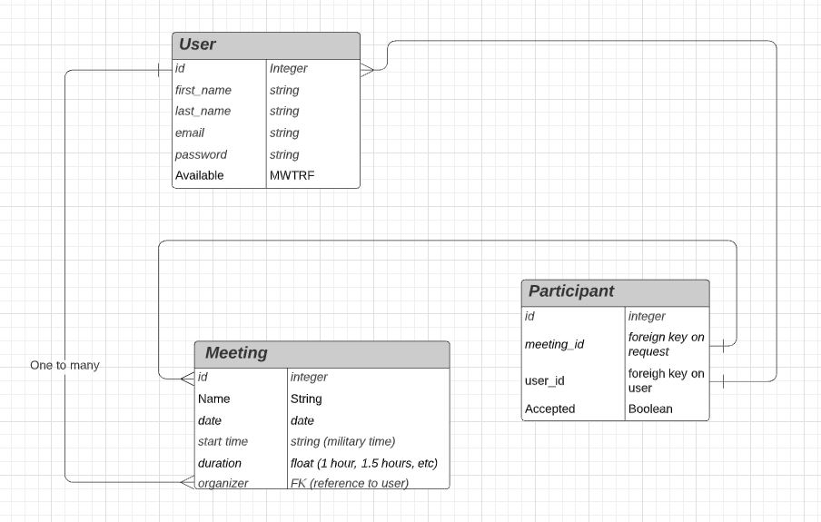
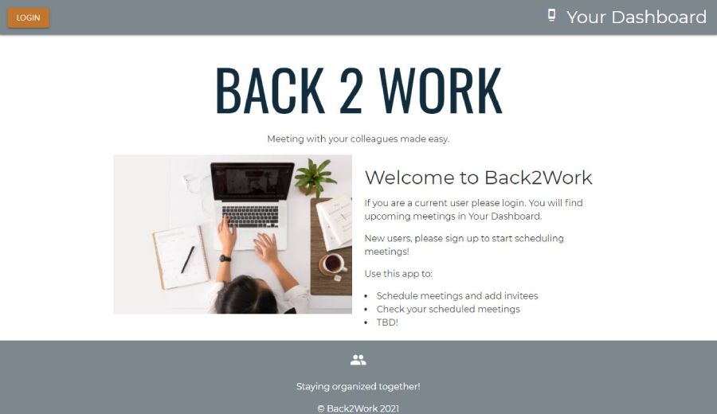

  

# Back2work -  Meeting Scheduling App
## UA Web Coding Bootcamp - Group Project Two
### March 31, 2021

Developers:
* [Alicia Vega](https://github.com/aliciavega731): Design, Front-end developent
* [George Bravo](https://github.com/gbravo23): Back-end development/API
* [Kate Lynn](https://github.com/klynn726): Front-end development
* [Vicky Loebel](https://github.com/vloebel): Front-end/ back-end, project manager

## Table of Contents  
* [Description](#Description)
* [Application_Links](#Application_Links)
* [User_Story](#User_Story)  
* [Entity_Relationship_Diagram](#Entity_Relationship_Diagram)  
* [Screen_Shot](#Screen_Shot)    
* [License](#License)

## Description  
With the Covid-19 Pandemic on the run, people are getting back to work, going into the office, attending classes in school. But how will we keep track of all our in-person commitments? Back2work is a is a full-stack web application that lets us schedule meetings and let organizers know whether or not you plan to attend.

### Application_Links
Deployed application: [back2work](https://vllback2work.herokuapp.com/)  
Github Repository: [github.com/vloebel/back2work](https://github.com/vloebel/back2work)

## User_Story 
As someone who is back to work with in-person meetings   
* I want to organize meeings for my friends and co-workers to attend   
* I want to be able to respond to meeting invitaitons and accept, decline, or let them know I'm not sure yet. 

## Entity_Relationship_Diagram  

## Libraries Used
* [Materialize.css](https://materializecss.com/)
* [Handlebars.js](https://handlebarsjs.com/)
* [express.js](https://expressjs.com/)
* [express-session](https://www.npmjs.com/package/express-session)
* [sequelize/mySql](http://sequelize.org/)
* [SyncFusion_Datepicker](https://help.syncfusion.com/js/datepicker/overview)
* [fonts.googleapis](https://fonts.google.com/)
* [font-awesome](https://fontawesome.com/)
* [jQuery](https://jquery.com/)

## Screen_Shot

## License
This software is distrubted without warranty under the MIT license agreement. To view terms and conditions, visit the [MIT License website](https://opensource.org/licenses/MIT).
